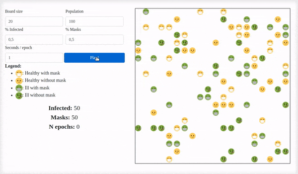
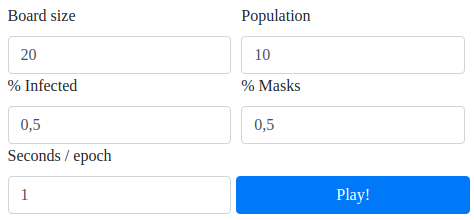

To begin with, as there is no better way of overviewing a project than to test it your self, the actual web-page is currently available [here](http://dangui.duckdns.org/wear-a-mask/simulation.html)

## Objectives

The main reason why this project was born was to raise awareness among the general population of the use of masks to prevent the spreading of COVID-19. It is a simple and personal gesture that has a real impact on the rest of the society, and this impact is the one that this simple web-page is pretending to give importance to. Through the implemented simulation, users can check how radically different is the evolution of the disease in random populations depending on the degree of mask use, as well as social distance, another key factor.

## Description

As it has been commented in the previous section, the site is based in a simulation where users can confirm the great impact of using a mask. In this section, the basics of how the simulation is organized will be explained:

First of all, the user can dynamically edit the values in which the simulation is based via the provided form. Editing this form will result in a reinitialization of the board and distribution of the population; as long as the simulation is not running, where the form remains read-only. 

Once the simulation has started, the randomly distributed population begins to move and to get infected. In relation with moves, each person chooses randomly where to move (or stay) among all the available positions. Dealing with the infections, when two people, one of them infected,  are closer than the minimum distance, a random test, based on the probabilities shown in the picture below, determines whether the other should get infected or not. A special comment should be done about the probabilities: they are based on some information provided by authorities and confirmed they are rational, but not scientifically proven, by a consulted doctor. This last comment is related to the fact that it is really difficult to determine an exact number, since the infection rate is based on multiple variables - viral load, wind, ...

After some tests with different combination of variables, the user should note that populations where mask percentage is higher take more epochs to get fully infected than others. Also, as expressed before, social distance (`board size`) is another key factor.

Moreover, the web has been developed mobile-responsive - adjusting to window size - so it can also be consulted through smartphones.

## Roadmap and future work

In future versions of this project, these may be some of the next steps:

* Learn about modularization in JavaScript, to better structure `simulation.js`
* Implement cured and death patients
* Include a lively graph showing the evolution of infections per epoch

## CS50

This project was developed with the basic knowledge of web programming that the course **CS50's Web Programming with Python and JavaScript** gave me. 

### Important files

* `simulation.py`: contains the logic of the simulation in _Python_ before it was translated to _JavaScript_.
* `simulation.js`: contains all the front-end functionality, from the proper simulation to control of inputs and buttons.
* `simulation.html`: main template, where the site is described, the user can type in the values for the different variables and the simulation is visualized.
* `forum.html`: forum template, where registered users can make comments about ideas for fighting COVID-19.

 ### Distinctiveness and complexity justification

I believe the project satisfies the specified requirements since the implemented idea is totally different to the projects developed in the course. The front-end simulation and animation required lots of _JavaScript_ work, and I definitely improved my skills of this language thanks to this final project. The forum part, which is more of the back-end, is quite simpler than the simulation part, but that is because the nature of the idea and because of the fact that most of the work was done in the front-end.

Enjoy...and #WearAMask!